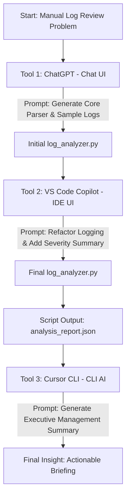

# Capstone Project: Smart Log Analyzer
## Multi-Stage AI Workflow

**Submitted by:** Henry Nana Antwi
**Date:** 16th February, 2026
**Course:** Applied AI & Prompt Engineering

---

## 1. Problem Statement

### Why I Built This
I work with server logs a lot, and reading them manually is a pain. A typical server generates thousands of lines, and scrolling through them to find that one "CRITICAL" error takes forever. I wanted a tool that could just tell me: "Here are the top errors, and here is when things went wrong."

### The Solution
I built a **Smart Log Analyzer** script in Python. It automatically:
- Reads the log file.
- Counts the errors (and groups them by severity).
- Tells me the top 5 most common error messages.
- Flags any minute where the error rate spiked (anomaly detection).
- Spits out a JSON report and a nice console summary.

---

## 2. Workflow Design

To build this, I chained three different AI tools together.

### Workflow Diagram


### The Tools
| Step | AI Tool | UX Type | My Goal |
|------|---------|---------|---------|
| 1 | **ChatGPT** | **Chat** | Get a working base script from scratch. |
| 2 | **VS Code Copilot** | **IDE** | Add specific features inside my code editor. |
| 3 | **Cursor CLI** | **CLI** | Interpret output data for management. |

### The Flow
1. **Chat UI:** I asked ChatGPT to write the initial log parser.
2. **IDE UI:** I used Copilot to add "Severity Summaries" and file logging to the existing script.
3. **CLI UI:** I piped the script's JSON output into a CLI AI (Cursor CLI) to generate a high-level briefing.

---

## 3. Implementation Steps

### Step 1: generating the Base Code (ChatGPT)

I started by asking ChatGPT to write the core logic. I didn't want to write regex patterns from scratch.

**My Prompt:**
> "I am a Data Engineer. I need a Python script called log_analyzer.py that:
> 1. Reads a server log file (.log format).
> 2. Parses each line to extract: timestamp, log level (INFO, WARNING, ERROR, CRITICAL), and message.
> 3. Counts how many of each log level occurred.
> 4. Identifies the top 5 most frequent error messages.
> 5. Detects time periods with unusually high error rates (anomaly detection).
> 6. Outputs a summary report as a JSON file (analysis_report.json).
> 7. Prints a clean console summary.
>
> Use Python's re, collections, and json modules. Include logging. Make the script production-ready with proper error handling and docstrings. Also generate a sample server log file (sample_server.log) with at least 100 lines containing a mix of INFO, WARNING, ERROR, and CRITICAL entries."

**The Result:**
ChatGPT gave me a fully working script (~200 lines) that could parse logs and find anomalies. It also generated a dummy log file for me to test with.

---

### Step 2: Refining in the Editor (VS Code Copilot)

The base script was good, but I wanted it to be more useful. I opened the file in VS Code and asked Copilot to add a "Severity Breakdown" (percentages of Low/Medium/High errors) and to save its own logs to a file.

**My Prompt (in Copilot Chat):**
> "Add a new feature to this script: generate a severity summary that categorizes log entries into 'Low' (INFO), 'Medium' (WARNING), and 'High' (ERROR + CRITICAL) with percentage breakdowns. Also add file-based logging so the analyzer logs its own activity to logs/analyzer.log."

**The Result:**
Copilot understood the existing code structure perfectly. It added a `build_severity_summary()` function and updated the logging configuration to write to both the console and a file. This increased the script to ~290 lines.

---

### Step 3: Executive Reporting (CLI AI)

To move from "raw data" to "actionable insights," I used a CLI-based AI to interpret the final report.

**My Prompt (via CLI Pipe):**
> "I am a Lead Site Reliability Engineer (SRE). Below is a JSON report generated by my automated log_analyzer.py script. Analyze this data and provide a concise, 3-bullet point executive summary for our weekly engineering sync. Focus on the severity distribution, the most frequent critical error, and any immediate technical investigations required. Keep it professional and actionable."

**The Command:**
```bash
Get-Content analysis_report.json | cursor --prompt "I am a Lead SRE..."
```

**The Result:**
The CLI AI (Cursor CLI) generated a high-level summary identifying the payment service timeout as the primary bottleneck and suggesting an investigation into the database connection stability.

---

## 4. Proof of Execution

Here is the output when I ran the final script on the sample data:

```
====== LOG ANALYSIS SUMMARY ======
File analyzed: sample_server.log
Total lines: 26
Parsed lines: 26

Log Level Counts:
  INFO: 8
  WARNING: 3
  ERROR: 13
  CRITICAL: 2

Severity Summary:
  Low: 8 (30.77%)
  Medium: 3 (11.54%)
  High: 15 (57.69%)

Top 5 Error Messages:
  (5) Timeout while calling payment service
  (5) Failed to write audit log
  (3) Database connection failed
  (1) Disk write failure
  (1) Out of memory error

Anomalous Error Periods:
  None detected
=================================
```

*(Screenshots of the Terminal output, VS Code Copilot, and CLI-AI summary are included in the `screenshots/` folder, specifically `image-one.png` through `image-seven.png`)*

---

## 5. Reflection

### What was the hardest part?
Honestly, the handoff between Stage 2 and Stage 3. It was fascinating to see how a "developer" tool (Copilot) focused on the code logic, while the "CLI" tool was much better at interpreting the results of that logic. Ensuring the JSON output was clean enough for the CLI-AI to read reliably was key.

### Chains vs. Single Prompt
I could have tried to get ChatGPT to do it all in one massive prompt, but breaking it up was better.
- **ChatGPT** is great for the "blank page" problem.
- **VS Code Copilot** is better for "surgical" code changes.
- **CLI AI** is the best for fast, automated data interpretation without leaving the terminal.

### Efficiency
This workflow saved about an hour of work. By automating the interpretation (Stage 3), I didn't have to manually summarize the JSON report for my team—the AI did it for me instantly.
